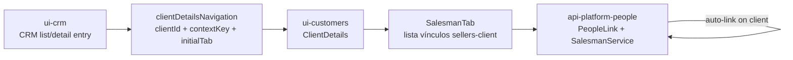

# Cliente × Vendedor — vínculo e permissões

Documentação técnica da entrega associada a `ControleOnline/ui-crm#2` (closed).

> Cópia operacional no repositório. A wiki do módulo (`ui-crm/wiki`) deve espelhar esta página quando o push da wiki estiver disponível.

## Objetivo

Registrar regras de negócio, modularização e contratos do fluxo que:

1. vincula vendedor a cliente quando o vínculo ainda não existe;
2. expõe o vendedor no detalhe do cliente a partir do CRM;
3. restringe gestão de vínculos e visualização de comissões conforme o app (`MANAGER` vs demais).

## Repositórios afetados

| Módulo | Papel no fluxo |
| --- | --- |
| `ui-crm` | Handoff do CRM para o detalhe do cliente com contexto de vendedores |
| `ui-customers` | Aba `Vendedores` no detalhe do cliente (listagem / gestão UI) |
| `api-platform-people` | Vínculo automático, distribuição de vendedores e recurso `people_link` |
| `app-community` | Fronteira de apps (`MANAGER` vs `CRM`) em `MODOS_OPERACAO.md` |

## Regras de negócio

### Vínculo automático

Quando uma pessoa/empresa se torna cliente (`PeopleLink.linkType = client`) e ainda **não** possui vendedor daquela empresa:

1. se o usuário logado for vendedor da empresa → vincula esse vendedor;
2. caso contrário → escolhe vendedor pela estratégia de distribuição da empresa (`salesman-distribution-strategy`):
   - `random` (default)
   - `round_robin`
   - `least_clients`
   - `last_received`

O vínculo criado usa `linkType = sellers-client`.

Implementação:

- `api-platform-people/src/Service/SalesmanService.php` — `discoverSalesmanForClient`, `getSalesmanFromCompany`
- `api-platform-people/src/Service/SalesmanDistributionService.php` — `discoverSalesman`

### Permissões por app

| Capacidade | `APP_TYPE=MANAGER` | Fora de `MANAGER` (ex.: CRM) |
| --- | --- | --- |
| Ver quem é o vendedor vinculado | sim | sim |
| Trocar / remover / adicionar múltiplos vendedores | sim | não |
| Editar vendedor no vínculo | sim | não |
| Ver `%` de comissão | sim | não |
| Ver valor mínimo de comissão | sim | não |

A fronteira oficial é por **app** (`APP_TYPE`), não apenas por role de empresa no front.

### Modelo de dados (vínculos)

- `PeopleLink` com `linkType`:
  - `client` — empresa ↔ cliente
  - `salesman` — empresa ↔ vendedor
  - `sellers-client` — vendedor ↔ cliente
- Campos sensíveis no vínculo: `comission`, `minimum_comission`

## Modularização e contratos

### `ui-crm`

- Responsabilidade: abrir `ClientDetails` só com `clientId` válido, `contextKey=client` e, para PJ, `initialTab=sellers`.
- Não assume gestão administrativa de comissões (isso é de `MANAGER` / `ui-customers`).

### `ui-customers`

- Responsabilidade: aba `Vendedores` no detalhe.
- `SalesmanTab` lista vínculos via `people_link` e navega para o detalhe da pessoa/empresa vinculada.
- Gestão administrativa (CRUD de vínculos + comissões) deve permanecer restrita a `APP_TYPE=MANAGER`.

### `api-platform-people`

- `SalesmanService` reage a `EntityChangedEvent` em `PeopleLink` com `linkType=client` e cria `sellers-client` quando necessário.
- `SalesmanDistributionService` aplica a estratégia configurada por empresa.
- `PeopleLinkService` é o ponto esperado de `securityFilter` / guards de leitura e escrita do recurso sensível (vínculos e comissões).

## Segurança (pontos de atenção)

1. Restrição de comissão fora de `MANAGER` **não** pode depender só de UI.
2. Escrita em `people_link` deve respeitar menor privilégio (evitar que “pode ler” vire “pode escrever” em outros `linkType`).
3. Escopo multiempresa: gestor de uma empresa não deve herdar gestão de `sellers-client` de outra empresa só porque o vendedor é compartilhado.

## Instalação / operação

Não há pacote isolado. O fluxo depende dos submódulos front (`ui-crm`, `ui-customers`) compostos no app e do módulo PHP `api-platform-people` na API.

Config relevante por empresa:

- chave `salesman-distribution-strategy` (default `random`)

## Manutenção

Ao alterar este fluxo:

1. atualizar esta página e as cópias nos módulos afetados;
2. manter testes focais de navegação CRM e de helpers da aba de vendedores;
3. validar enforcement de `people_link` no backend antes de liberar exposição de comissão.

## Referências internas

- Issue: `ControleOnline/ui-crm#2`
- PRs da trilha (histórico): `ui-crm#10`, `ui-customers#3`, `api-platform-people#4`
- Fronteira de apps: `app-community/MODOS_OPERACAO.md`
