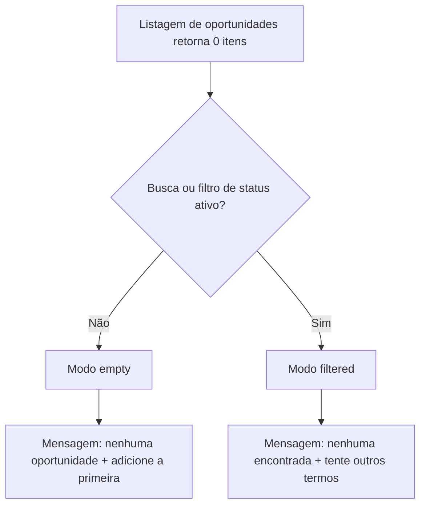

# Oportunidades — estado vazio e filtros

Documentação técnica da entrega associada a `ControleOnline/app-community#43` (closed) e `ControleOnline/ui-crm#6` (merged).

> Cópia operacional no repositório (`docs/technical/`). A wiki do módulo (`ui-crm/wiki`) deve espelhar esta página.

## Objetivo

Registrar a regra de negócio e o contrato de UI da listagem de oportunidades no CRM quando a lista retorna zero itens, distinguindo:

1. lista realmente vazia (sem filtro ativo);
2. lista vazia por causa de busca ou filtro de status.

## Repositórios afetados

| Módulo | Papel no fluxo |
| --- | --- |
| `ui-crm` | Listagem de oportunidades, helper de estado vazio e mensagens |
| `app-community` | Issue agregadora do fluxo CRM / oportunidades |
| `api-community` | Sem alteração nesta entrega |
| `api-whatsapp` | Sem alteração nesta entrega |

## Visão de módulo (`APP_TYPE`)

| `APP_TYPE` | Papel |
| --- | --- |
| **CRM** | Visão comercial — dono da listagem de oportunidades (`ui-crm`) |
| **MANAGER** | Backoffice; não é o dono deste fluxo de listagem comercial |
| **POS / SHOP / …** | Fora do escopo deste fluxo |

`ui-crm` atende exclusivamente a visão comercial. A regra de estado vazio aplica-se à tela de oportunidades do CRM e não deve ser assumida por outros módulos de listagem.

## Regra de negócio

Quando a listagem de oportunidades não retorna itens, a mensagem e a ação sugerida dependem de haver **filtro ativo**.

### Filtros considerados ativos

Qualquer um dos seguintes torna o estado “filtrado”:

- termo de busca (`searchQuery`) não vazio após trim;
- filtro de status (`selectedStatusFilterKey`) não vazio após trim.

Espaços em branco isolados **não** contam como filtro ativo.

### Modos de estado vazio

| Modo | Condição | Título (i18n) | Subtítulo (i18n) | Intenção |
| --- | --- | --- | --- | --- |
| `empty` | Sem busca e sem filtro de status | `people.state.noOpportunity` | `people.state.addFirstOpportunity` | Convidar o usuário a criar a primeira oportunidade |
| `filtered` | Busca **ou** filtro de status ativo | `people.state.noOpportunityFound` | `people.state.tryOtherTerms` | Indicar que o filtro/busca não encontrou resultados |

### Comportamento esperado (exemplos)

- Usuário sem oportunidades e sem filtro → “Nenhuma oportunidade” + sugestão de adicionar a primeira.
- Usuário com oportunidades, mas filtro de status “fechado” (ou qualquer status) sem match → “Nenhuma oportunidade encontrada” + “Tente outros termos” (não sugerir criar a primeira).
- Busca textual sem match → mesmo modo `filtered`.

## Modularização e contrato

### Helper canônico

Arquivo: `src/react/utils/opportunityEmptyState.js`

```js
getOpportunityEmptyStateMode({ searchQuery, selectedStatusFilterKey })
// → 'empty' | 'filtered'

hasActiveOpportunityFilters({ searchQuery, selectedStatusFilterKey })
// → boolean
```

- A decisão de modo **não** depende da quantidade de itens retornada pela API.
- A tela (`src/react/pages/crm/index.js`) calcula o modo a partir dos filtros atuais e escolhe as chaves i18n correspondentes.
- Testes: `src/tests/react/utils/opportunityEmptyState.test.js` (comando de referência: `npm run test:crm-empty-state`).

### O que este módulo **não** deve assumir

- Não altera contratos de API de oportunidades.
- Não redefine filtros de outros contextos (ex.: listagens em `ui-customers` ou backoffice).
- Não substitui mensagens genéricas de empty state de outros módulos.

## Fluxo resumido



## Instalação / operação

Nenhuma configuração adicional. A regra entra em vigor com o código do módulo `ui-crm` em `master` (após merge de `ui-crm#6`).

Validação automatizada disponível no workflow de PR do repositório (`Pull Request Checks` / `test:crm-empty-state`).

## Manutenção

- Ao adicionar novos filtros na listagem de oportunidades, atualizar `hasActiveOpportunityFilters` e os testes correspondentes.
- Manter as chaves i18n alinhadas entre título e subtítulo de cada modo.
- Qualquer mudança de comportamento de empty state deve ser documentada nesta página e refletida na Home/Sidebar do módulo.

## Links cruzados

| Destino | URL |
| --- | --- |
| Home do módulo | https://github.com/ControleOnline/ui-crm/wiki |
| Issue de origem | https://github.com/ControleOnline/app-community/issues/43 |
| PR de entrega | https://github.com/ControleOnline/ui-crm/pull/6 |
| Wiki do app | https://github.com/ControleOnline/app-community/wiki |
| Visões do app | https://github.com/ControleOnline/app-community/blob/master/MODOS_OPERACAO.md |
| Cliente × Vendedor (mesmo módulo) | https://github.com/ControleOnline/ui-crm/wiki/Cliente-Vendedor-Vinculo-e-Permissoes |
