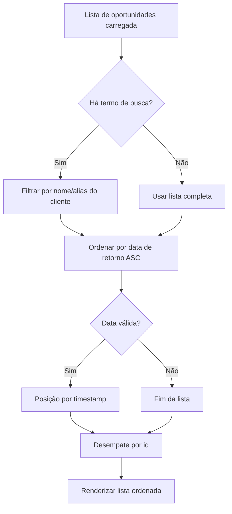

# Oportunidades — ordenação por data de retorno

Documentação técnica da entrega associada a `ControleOnline/app-community#69` (closed) e `ControleOnline/ui-crm#7`.

> Cópia operacional no repositório (`docs/technical/`). A wiki do módulo (`ui-crm/wiki`) é a fonte primária de leitura.

## Objetivo

Registrar a regra de negócio e o contrato de UI da **ordenação automática** da listagem de oportunidades no CRM:

- priorizar a **data de retorno** da mais antiga para a mais nova;
- empurrar itens **sem data válida** para o final da lista;
- usar `id` como desempate estável.

## Repositórios afetados

| Módulo | Papel no fluxo |
| --- | --- |
| `ui-crm` | Listagem de oportunidades; ordenação client-side após filtro de busca |
| `app-community` | Issue agregadora do fluxo CRM / oportunidades |
| `api-community` | Sem alteração nesta entrega (ordenação não depende de parâmetro de API) |
| `api-whatsapp` | Sem alteração nesta entrega |

## Visão de módulo (`APP_TYPE`)

| `APP_TYPE` | Papel |
| --- | --- |
| **CRM** | Visão comercial — dono da listagem de oportunidades (`ui-crm`) |
| **MANAGER** | Backoffice; não é o dono deste fluxo de listagem comercial |
| **POS / SHOP / …** | Fora do escopo deste fluxo |

`ui-crm` atende exclusivamente a visão comercial. A regra de ordenação aplica-se à tela de oportunidades do CRM e **não** deve ser assumida por outros módulos de listagem.

## Regra de negócio

A listagem visível de oportunidades é ordenada **depois** do filtro de busca textual.

### Campos de data usados

Para cada oportunidade, a data efetiva considerada é, nesta ordem de preferência:

1. `dueDate` (data de retorno principal)
2. `alterDate` (fallback)

Se ambos estiverem ausentes ou resultarem em timestamp inválido (`NaN`), a oportunidade é tratada como **sem data válida**.

### Critérios de ordenação

| Prioridade | Critério | Comportamento |
| --- | --- | --- |
| 1 | Timestamp da data de retorno | Ascendente (mais antiga → mais nova) |
| 2 | Itens sem data válida | Vão para o final (`Number.POSITIVE_INFINITY`) |
| 3 | `id` numérico | Desempate estável (menor id primeiro) |

A ordenação é **client-side**, aplicada sobre o array já filtrado pela busca (quando houver termo). Não altera a ordem retornada pela API nem parâmetros de listagem remotos.

### Comportamento esperado (exemplos)

- Três oportunidades com datas 10/01, 05/01 e 20/01 → ordem: 05/01, 10/01, 20/01.
- Uma oportunidade sem `dueDate`/`alterDate` e outras com datas → a sem data aparece **depois** de todas as com data válida.
- Duas com a mesma data de retorno → ordem estável pelo `id`.

## Modularização e contrato

### Local da implementação

Arquivo: `src/react/pages/crm/index.js`

Trecho relevante (resumo):

```js
const visibleOpportunities = React.useMemo(() => {
  // 1) filtra por busca textual (quando houver)
  const filteredOpportunities = /* ... */;

  // 2) ordena
  return [...filteredOpportunities].sort((left, right) => {
    const leftDateValue = left?.dueDate || left?.alterDate || null;
    const rightDateValue = right?.dueDate || right?.alterDate || null;
    // timestamps inválidos → Infinity (fim da lista)
    // depois: id como desempate
  });
}, [allOpportunities, /* ... */, searchQuery]);
```

- A busca textual continua independente da ordenação: primeiro filtra, depois ordena.
- A tela não depende de `order`/`sort` da API para esta regra.

### O que este módulo **não** deve assumir

- Não altera contratos de API de oportunidades (não envia parâmetro de ordenação).
- Não redefine ordenação de outras listagens (propostas, clientes, etc.).
- Não deve ser copiado cegamente para `MANAGER` ou outras visões sem reavaliar o domínio.

## Fluxo resumido



## Instalação / operação

Nenhuma configuração adicional. A regra entra em vigor com o código do módulo `ui-crm` após o merge de `ui-crm#7` (ou equivalente em `master`/`staging`).

Validação: revisão do diff no PR e inspeção visual da listagem no CRM (ordenar mentalmente pelas datas de retorno exibidas).

## Manutenção

- Ao introduzir novos campos de data de retorno, atualizar a expressão `dueDate || alterDate` e esta página.
- Se a API passar a oferecer ordenação nativa, documentar se a ordenação client-side deve ser removida ou mantida como fallback.
- Qualquer mudança de comportamento de ordenação deve ser refletida na Home/Sidebar do módulo e no `AGENTS.md`.

## Links cruzados

| Destino | URL |
| --- | --- |
| Home do módulo | https://github.com/ControleOnline/ui-crm/wiki |
| Issue de origem | https://github.com/ControleOnline/app-community/issues/69 |
| PR de entrega | https://github.com/ControleOnline/ui-crm/pull/7 |
| Wiki do app | https://github.com/ControleOnline/app-community/wiki |
| Visões do app | https://github.com/ControleOnline/app-community/blob/master/MODOS_OPERACAO.md |
| Oportunidades — estado vazio e filtros (mesmo módulo) | https://github.com/ControleOnline/ui-crm/wiki/Oportunidades-Estado-Vazio-e-Filtros |
| Documentação para clientes (ordenação) | https://ajuda.controleonline.com/index.php/Project/CRM_-_Entender_a_ordena%C3%A7%C3%A3o_da_lista_de_oportunidades |
