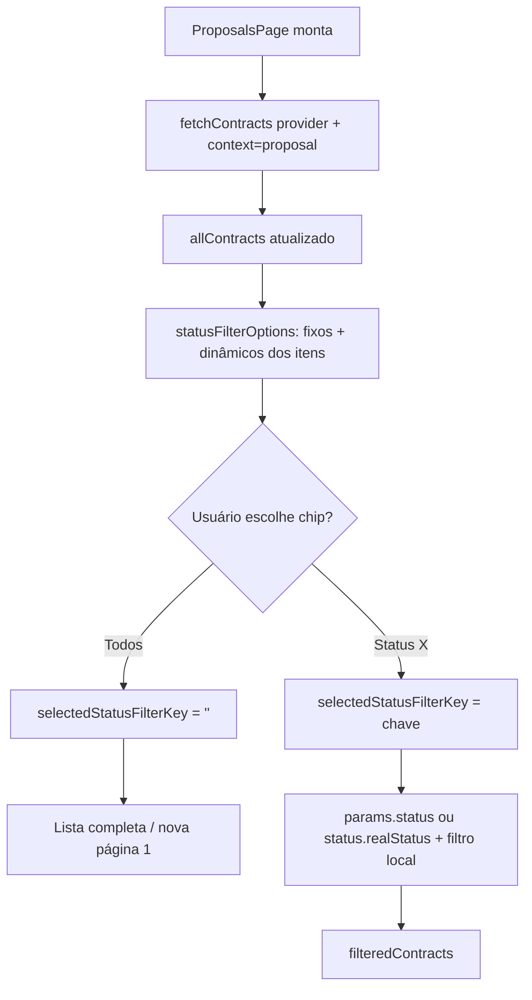

# Propostas — Filtro de status

## Objetivo

Documentar a regra de negócio e o comportamento técnico do filtro de status na lista de propostas do CRM (`APP_TYPE=CRM`), implementado em `ui-crm`.

Esta página cobre o que o módulo faz (e o que não deve fazer) em relação ao filtro de status das propostas.

## Visão e fronteiras (`APP_TYPE`)

| Aspecto | Detalhe |
| --- | --- |
| Visão | `APP_TYPE=CRM` (visão comercial) |
| Módulo dono | `ui-crm` |
| Página | `src/react/pages/proposals/index.js` (`ProposalsPage`) |
| Público | Vendedor, consultor comercial, pré-venda e pós-venda comercial |

**O que o módulo faz neste fluxo**

- Lista propostas (`contractModel.context = proposal`) da empresa atual (`provider`).
- Oferece filtro horizontal de status (chips) acima da lista.
- Mantém opções fixas de status reais (`open`, `pending`, `closed`) e **adiciona dinamicamente** qualquer status presente nas propostas já carregadas.
- Filtra localmente e/ou envia parâmetro de status na requisição quando o usuário seleciona um chip.

**O que o módulo não deve fazer**

- Não inventar status administrativos que pertencem a `MANAGER` / `ADMIN`.
- Não operar caixa (`POS`) nem vitrine (`SHOP`).
- Não substituir a fonte de verdade de status do backend (store `contract`).

Referência de fronteiras: [MODOS_OPERACAO.md](https://github.com/ControleOnline/app-community/blob/master/MODOS_OPERACAO.md).

## Comportamento do filtro

### Opções fixas (sempre disponíveis)

| Chave interna | Label padrão (i18n) | `realStatus` |
| --- | --- | --- |
| `realStatus:open` | Em aberto | `open` |
| `realStatus:pending` | Pendente | `pending` |
| `realStatus:closed` | Fechado | `closed` |

Além do chip **Todos** (filtro vazio / sem restrição).

### Opções dinâmicas

Para cada proposta carregada em `allContracts`:

1. Extrai o objeto `status` do contrato.
2. Gera uma chave estável via `getStatusFilterKey`:
   - Se existir `@id` → usa o IRI (`/statuses/{id}`).
   - Senão, se existir `id` → monta `/statuses/{id}`.
   - Senão → usa `realStatus:{normalized}` a partir de `realStatus` ou `status`.
3. Se a chave ainda não estiver nas opções, adiciona um chip com:
   - `label` via `getStatusLabel` (mapa i18n + fallback do valor bruto),
   - `color` do próprio status ou mapa de cores por status normalizado.

Assim o filtro **não fica limitado** a um conjunto estático: qualquer status que venha nas propostas passa a aparecer como opção.

### Seleção e persistência na UI

- Estado: `selectedStatusFilterKey` (string; vazio = Todos).
- Ao mudar o filtro, a página volta para a página 1.
- Se a opção selecionada deixar de existir nas opções (ex.: refresh sem aquele status), o filtro é limpo automaticamente.

### Requisição ao backend

Em `fetchContracts`:

```text
params = {
  provider: currentCompany.id,
  'contractModel.context': 'proposal',
  page: ...
}
```

Quando há filtro selecionado:

- Chave começando com `/statuses/` → `params.status = <IRI>`.
- Chave `realStatus:...` → `params['status.realStatus'] = <valor>`.

A lista também aplica filtro local (`contractMatchesStatusFilter`) sobre `allContracts` para garantir consistência visual com os chips.

### Matching local

`contractMatchesStatusFilter(contract, filterKey)`:

- Sem chave → todos passam.
- IRI `/statuses/...` → compara `@id`/`id` do status; se necessário, cai no `normalizedStatus` da opção selecionada.
- `realStatus:...` → compara o status normalizado (`realStatus` ou `status` em minúsculas, espaços normalizados).

## Cores e labels de status

| Status normalizado | Cor |
| --- | --- |
| `ativo` / `active` / `assinado` / `signed` | Verde `#10B981` |
| `inativo` / `inactive` / `cancelado` / `canceled` | Vermelho `#c10015` |
| `pendente` / `pending` | Laranja `#e67e22` |
| `open` / `aberto` | Azul `#3B82F6` |
| demais | Cinza `#64748B` |

Labels passam por mapa i18n (`contract.status.*`) com fallback para o valor bruto ou `N/A`.

## Estados de lista

| Situação | Comportamento |
| --- | --- |
| Loading inicial | Spinner + texto de carregamento |
| Erro sem itens | Mensagem de erro |
| Lista vazia sem filtro | Empty state de “sem propostas” + dica de criar |
| Lista vazia **com** filtro de status | Empty state específico de “nenhuma proposta neste status” + dica de status |
| Busca textual ativa | Dica de ajuste de busca |

## Fluxo resumido (Mermaid)



## Arquivos de referência

| Arquivo | Papel |
| --- | --- |
| `src/react/pages/proposals/index.js` | Página, opções de filtro, fetch e matching |
| `src/react/pages/proposals/index.styles.js` | Estilos dos chips de status |
| Store `contract` | Fonte de itens / totalItems / loading |

## Links relacionados

- Home do módulo: https://github.com/ControleOnline/ui-crm/wiki
- Wiki do app: https://github.com/ControleOnline/app-community/wiki
- Tutorial público (cliente): https://ajuda.controleonline.com/index.php/Project/CRM_-_Como_filtrar_propostas_por_status
- Issue de origem: https://github.com/ControleOnline/app-community/issues/46

## Histórico desta documentação

- 2026-08-05 — Documentação técnica inicial do filtro dinâmico de status das propostas (issue #46).
